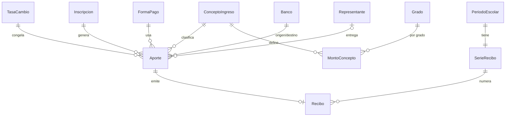

# Edumia — Diseño de modelos: `cambio` e `ingresos`

Estado: **aprobado** · 2026-09-21
Depende de: `MODELOS_core_academico.md` (aprobado), D-02, D-06, D-07, D-09.

---

## App `cambio`

### `TasaCambio` (simple-history)
| Campo | Tipo | Notas |
| --- | --- | --- |
| `fecha` | Date | |
| `valor` | Decimal(18,4) | Bs. por 1 USD. `CheckConstraint(valor > 0)` |
| `fuente` | Char, choices | `bcv`, `paralelo`, `consejo`, `manual` |
| `cargada_por` | FK User | |
| `creada_en` | DateTime | |

- **Único `(fecha, fuente)`**, no solo `fecha` como en el plan. Cuesta lo mismo hoy y evita una migración si conviven dos fuentes (ver I-3).
- No se edita `valor` si alguna transacción la referencia; se corrige cargando una fila nueva. Las transacciones ya guardan `tasa_aplicada`, así que el pasado no cambia.
- Índice `(fuente, -fecha)`: la búsqueda de "última tasa anterior a X" es la consulta más frecuente.

### `cambio/services.py` (único lugar donde se convierte)
| Función | Devuelve |
| --- | --- |
| `obtener_tasa(fecha, fuente=None)` | `(TasaCambio, es_exacta: bool)`. Si no hay tasa ese día, la última anterior con `es_exacta=False`; si no existe ninguna, lanza `SinTasaError` |
| `convertir(monto, moneda, tasa_valor)` | `(monto_ves, monto_usd)`, ambos `Decimal` a 4 decimales, `ROUND_HALF_UP` |
| `formatear(monto, decimales=2)` | Cadena `1.234,56` para la vista (es-VE) |

Reglas de `convertir`: la moneda de origen queda exacta (no se recalcula) y solo se deriva la otra.
- `USD`: `monto_usd = monto`; `monto_ves = monto × tasa`
- `VES`: `monto_ves = monto`; `monto_usd = monto ÷ tasa`

### `MontoBimonedaMixin` (abstracto, lo heredan `Aporte` y `Gasto`)
Campos: `monto`, `moneda` (`VES`/`USD`), `tasa` (FK PROTECT), `tasa_aplicada`, `monto_ves`, `monto_usd`.
- `calcular_montos()` se llama en `save()`: fija `tasa_aplicada = tasa.valor` y ambos equivalentes.
- Si el registro ya está verificado/aprobado, `save()` **no** recalcula (D-09).
- Índices por cada modelo que lo use: `(moneda)` no hace falta; los reportes suman `monto_ves`/`monto_usd` con `Sum()`.

Tests obligatorios de `services.py` (Fase 2): redondeo en .5 exacto, tasa con 4 decimales, monto cero, USD→VES→USD sin deriva mayor a 0,0001, y `SinTasaError`.

---

## App `ingresos`

### `Banco`
`nombre` Char(80), `codigo` Char(4) único (`0102`), `activo`. Se carga como fixture con los bancos venezolanos.

### `FormaPago`
| Campo | Tipo | Notas |
| --- | --- | --- |
| `nombre` | Char(50), único | |
| `moneda_fija` | Char null | `USD` para "Divisa efectivo" y Zelle; null = cualquiera |
| `requiere_banco_destino` | Bool | **Añadida** (ver I-4) |
| `requiere_banco_origen` | Bool | |
| `requiere_referencia` | Bool | |
| `requiere_telefono` | Bool | |
| `requiere_cedula` | Bool | |
| `activo` | Bool | |

Configuración inicial sugerida:

| Forma de pago | destino | origen | ref. | tel. | cédula | moneda |
| --- | --- | --- | --- | --- | --- | --- |
| Efectivo (Bs.) | – | – | – | – | – | VES |
| Divisa efectivo | – | – | – | – | – | USD |
| Pago móvil | sí | sí | sí | sí | sí | VES |
| Transferencia | sí | – | sí | – | sí | VES |
| Zelle | – | – | sí | – | – | USD |

### `ConceptoIngreso`
| Campo | Tipo | Notas |
| --- | --- | --- |
| `nombre` | Char(100), único | |
| `periodicidad` | Char, choices | `unico`, `mensual` (reemplaza `es_recurrente`, ver I-1) |
| `monto_sugerido` | Decimal null | Valor por defecto si no hay `MontoConcepto` (D-07) |
| `moneda_sugerida` | Char null | |
| `fondo` | FK `gastos.Fondo` null | Fondo destino; null → General (P-04 pendiente) |
| `activo` | Bool | |

### `MontoConcepto` (D-07)
| Campo | Tipo |
| --- | --- |
| `concepto` | FK PROTECT |
| `grado` | FK PROTECT |
| `periodo` | FK PROTECT |
| `monto` | Decimal(18,4) |
| `moneda` | Char, VES/USD |

Único `(concepto, grado, periodo)`.
Resolución del monto esperado (función única `monto_esperado(concepto, inscripcion)`): 1) `MontoConcepto` de su grado y período; 2) si no existe, `monto_sugerido`; 3) si tampoco, `None` (sin validación de desviación y sin morosidad para ese concepto).

### `Aporte` (hereda `MontoBimonedaMixin`, simple-history)
| Grupo | Campos |
| --- | --- |
| Identidad | `uuid_cliente` UUID null único (idempotencia de la Fase 7, ver I-5), `inscripcion` FK PROTECT, `concepto` FK PROTECT, `periodo` FK PROTECT (denormalizado desde `inscripcion.periodo`), `fondo` FK PROTECT no nulo (copia de `concepto.fondo` al registrar; si es null, el Fondo General, ver G-4 en `MODELOS_gastos.md`) |
| Cobertura | `mes_cubierto` Date null (día 1 del mes; obligatorio si `concepto.periodicidad == mensual`, ver I-1) |
| Dinero | heredado del mixin |
| Pago | `forma_pago` FK, `fecha_pago` Date, `banco_destino` FK null, `banco_origen` FK null, `referencia` Char(40) blank, `telefono_emisor` Char(11) blank, `cedula_titular` Char(20) blank, `nombre_titular` Char(150) blank, `nota_pago` Text blank |
| Entrega | `entregado_por` FK Representante null, `entregado_por_nombre` Char(150) blank |
| Flujo | `estado`, `registrado_por`, `fecha_registro`, `verificado_por` null, `fecha_verificacion` null, `observacion` Text blank, `motivo_anulacion` Text blank, `anulado_por` null, `fecha_anulacion` null |
| Control | `desviacion_confirmada` Bool, `creado_en`, `actualizado_en` |

Restricciones y validaciones (en `clean()` y respaldadas en BD cuando se puede):
1. Campos de pago obligatorios según las banderas de `forma_pago`; si `moneda_fija`, la moneda debe coincidir.
2. `UniqueConstraint(banco_destino, referencia, fecha_pago)` con `condition=~Q(referencia="")`.
3. Normalización al guardar de `cedula_titular`, `telefono_emisor` y `referencia` (mayúsculas, sin espacios) con el helper de `core/utils.py`.
4. Al menos uno de `entregado_por` / `entregado_por_nombre` (el recibo necesita un nombre).
5. `fecha_pago` dentro del rango del período y período no cerrado.
6. `monto > 0` (`CheckConstraint`).
7. Si el monto se desvía más de un umbral (propuesta: ±20 %) de `monto_esperado`, pide confirmación y guarda `desviacion_confirmada=True`. No bloquea.
8. `estado == verificado` → solo admite la transición a `anulado`.
9. `inscripcion.estado` debe ser `activo` al registrar (retirados no aportan; el administrador puede reactivar).

Índices: `(periodo, estado)`, `(inscripcion, fecha_pago)`, `(registrado_por, estado)`, `(cedula_titular)`, `(telefono_emisor)`, `(referencia)`. Los tres últimos sirven la búsqueda de la Fase 3.

### Máquina de estados
| De → A | Quién | Condición |
| --- | --- | --- |
| borrador → registrado | Docente (dueño de la sección) / Admin | Pasa todas las validaciones |
| registrado → verificado | Admin | Emite el recibo en la misma transacción (D-09) |
| registrado → observado | Admin | `observacion` obligatoria |
| observado → registrado | Docente / Admin | Tras corregir |
| registrado / observado / verificado → anulado | Admin | `motivo_anulacion` obligatorio; anula el recibo si existe |

Cada transición escribe en `RegistroAuditoria` y vive en un solo método (`Aporte.transicionar(nuevo_estado, usuario, motivo=None)`) que las vistas llaman; ninguna vista cambia `estado` directamente.

Registro en lote (pantalla del docente): una tasa y una fecha para todo el lote, una fila por inscrito activo de la sección, cada fila se valida por separado; las válidas se guardan y las inválidas vuelven marcadas. Todo dentro de una transacción por fila, no una global, para que un error no pierda 30 aportes buenos.

### `SerieRecibo`
`periodo` OneToOne PROTECT, `prefijo` Char(20) (`2025-2026`), `ultimo_numero` PositiveInt default 0.
Asignación de número: `transaction.atomic()` + `SerieRecibo.objects.select_for_update().get(periodo=...)` + incremento. Jamás `max()+1`.

### `Recibo`
| Campo | Notas |
| --- | --- |
| `aporte` | OneToOne PROTECT |
| `serie` | FK PROTECT |
| `numero` | PositiveInt |
| `numero_texto` | `2025-2026-000147`, único |
| `uuid` | UUID único, para `/recibo/<uuid>/` |
| `fecha_emision` | DateTime |
| `emitido_por` | FK User |
| Copias congeladas | `entregado_por_texto`, `estudiante_texto`, `seccion_texto`, `concepto_texto`, `docente_texto` (ver I-6) |
| Anulación | `anulado` Bool, `motivo_anulacion`, `anulado_por`, `fecha_anulacion` |

- Único `(serie, numero)`.
- Los montos, tasa y forma de pago **no** se copian: salen del `Aporte`, que ya es inmutable tras verificar.
- El recibo público muestra el mínimo: número, fecha, monto, concepto, nombre del estudiante y estado (vigente/anulado). Sin cédulas ni teléfono.

Prueba de concurrencia (Fase 4): 20 hilos verificando simultáneamente contra Postgres real (no SQLite); deben salir 20 números consecutivos sin huecos ni duplicados.

---

## Diagrama

## Cambios respecto al plan (para tu aprobación)

- [x] **I-1 `mes_cubierto` + `periodicidad`.** El plan solo tenía `es_recurrente`. Sin saber qué mes cubre cada aporte mensual, el reporte de morosidad no puede decir quién debe marzo. Se añade `mes_cubierto` y `periodicidad` (`unico`/`mensual`).
- [x] **I-2 (pago parcial aceptado; a confirmar con el administrador, P-07) Moneda de comparación en morosidad.** El esperado está en la moneda de `MontoConcepto`; se compara con `monto_usd` o `monto_ves` del aporte según esa moneda, sumando pagos parciales del mismo mes. Confirma si se acepta pago parcial.
- [x] **I-3 `TasaCambio` única por `(fecha, fuente)`** en lugar de solo `fecha`.
- [x] **I-4 `requiere_banco_destino`** como quinta bandera en `FormaPago` (el plan describía cuatro pero también exige banco destino).
- [x] **I-5 `uuid_cliente`** en `Aporte` desde la Fase 3, aunque la cola offline sea de la Fase 7: evita migrar la tabla más grande después.
- [x] **I-6 Copias congeladas en `Recibo`** de nombres (entregó, estudiante, sección, concepto, docente): cumple "el recibo conserva el nombre tal como se imprimió".
- [x] **I-7 `Aporte.fondo` copiado al registrar**, para que cambiar el fondo de un concepto no altere aportes ya hechos.
- [x] Umbral de desviación: ±20 % (aprobado; constante configurable en `settings`)

## Pendiente que sigue abierto

- P-03 (qué tasa es la oficial) condiciona el valor por defecto de `fuente` y qué tasa toma el formulario.
- P-04 (fondo contable o informativo) condiciona `ConceptoIngreso.fondo`.
