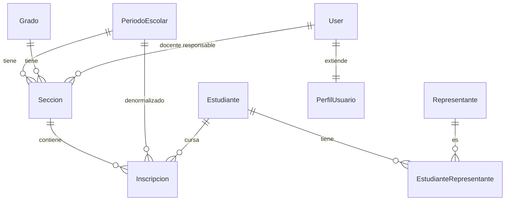

# Edumia — Diseño de modelos: `core` y `academico`

Estado: **aprobado** · 2026-09-21
Convenciones: nombres en español, `snake_case`; todo modelo con `creado_en` / `actualizado_en`; `simple-history` donde se indica; sin `delete` en la UI (se desactiva con `activo=False`).

---

## App `core`

### `Institucion` (singleton)
| Campo | Tipo | Notas |
| --- | --- | --- |
| `nombre` | Char(200) | Encabezado de recibos |
| `rif` | Char(20) | |
| `codigo_dea` | Char(20), blank | Código del plantel |
| `direccion` | Text | |
| `telefono` | Char(30), blank | |
| `email` | Email, blank | |
| `logo` | — | **No hay campo**: sin archivos (D-05). El logo se sirve como estático (`static/img/logo.png`) |

Singleton: `save()` fuerza `pk=1`; el admin no permite agregar si ya existe ni borrar.

### `PeriodoEscolar` (historial)
| Campo | Tipo | Notas |
| --- | --- | --- |
| `nombre` | Char(20), único | `2025-2026` |
| `fecha_inicio`, `fecha_fin` | Date | `clean()`: inicio < fin |
| `activo` | Bool | |
| `cerrado` | Bool | Bloquea registros con fecha dentro (D-09) |
| `cerrado_por` / `fecha_cierre` | FK User null / DateTime null | Se llenan al cerrar |

- `UniqueConstraint(fields=["activo"], condition=Q(activo=True))` → un solo período activo.
- Rango de fechas sin traslape entre períodos (validación en `clean()`).
- Un período `cerrado` puede seguir `activo` hasta abrir el siguiente; son banderas distintas a propósito.

### `PerfilUsuario`
| Campo | Tipo | Notas |
| --- | --- | --- |
| `user` | OneToOne User | |
| `rol` | Char, choices | `administrador`, `docente`, `responsable_fondo`, `director`, `auditor` |
| `fondo` | FK `gastos.Fondo` null | Solo para `responsable_fondo`; referencia por string para evitar import circular |
| `telefono` | Char(20), blank | |
| `debe_cambiar_clave` | Bool, default True | Primer ingreso |

- El `rol` se sincroniza con el `Group` de Django en `save()` (una sola fuente de verdad: el `rol`; el grupo lo deriva).
- **La sección del docente NO vive aquí.** Se obtiene de `Seccion.docente_responsable` en el período activo. Así reasignar un docente a mitad de año es editar la sección, no dos sitios.
- Constraint: `fondo` obligatorio si `rol == responsable_fondo`, prohibido en los demás.

### `RegistroAuditoria` (solo inserción)
| Campo | Tipo | Notas |
| --- | --- | --- |
| `usuario` | FK User null | Null para eventos anónimos (login fallido) |
| `accion` | Char, choices | `login`, `login_fallido`, `verificar`, `anular`, `emitir_recibo`, `cargar_tasa`, `cerrar_periodo`, `reabrir_periodo` |
| `modelo` | Char(60) | |
| `objeto_id` | Char(64) | Char por si luego hay UUID |
| `descripcion` | Text | |
| `ip` | GenericIPAddress null | |
| `fecha` | DateTime, índice | |

- Sin edición ni borrado, ni en el admin (`has_change_permission` / `has_delete_permission` = False).
- Índices: `(modelo, objeto_id)`, `(usuario, fecha)`, `(accion, fecha)`.

### Mixins (no son modelos)
`RolRequeridoMixin`, `SeccionDocenteMixin` (filtra por `docente_responsable` en `get_queryset`), `FondoResponsableMixin`, `SoloLecturaMixin` (director, auditor), `PeriodoAbiertoMixin` (rechaza escrituras en período cerrado).

---

## App `academico`

### `Grado`
| Campo | Tipo | Notas |
| --- | --- | --- |
| `nombre` | Char(50) | `5to grado` |
| `nivel` | Char, choices | `inicial`, `primaria`, `media` |
| `orden` | PositiveSmallInt | Para ordenar y para promover al siguiente |

- Único `(nombre, nivel)`. El "siguiente grado" de la promoción masiva se resuelve por `orden`.

### `Seccion`
| Campo | Tipo | Notas |
| --- | --- | --- |
| `grado` | FK Grado (PROTECT) | |
| `periodo` | FK PeriodoEscolar (PROTECT) | |
| `nombre` | Char(10) | `A`, `B`, `U` |
| `docente_responsable` | FK User null (SET_NULL) | Null permitido: la sección puede existir antes de asignar docente |
| `activa` | Bool | |

- Único `(grado, nombre, periodo)`.
- Se crean nuevas secciones por período; no se reutilizan entre períodos (así el histórico de docente por sección queda intacto).
- `clean()`: el `docente_responsable` debe tener `rol == docente`.
- Índice `(periodo, docente_responsable)`: es la consulta que hace el mixin de permisos en cada request.

### `Estudiante` (simple-history)
| Campo | Tipo | Notas |
| --- | --- | --- |
| `cedula_escolar` | Char(20), null, único | Normalizada: sin puntos, guiones ni espacios, mayúsculas |
| `nombres`, `apellidos` | Char(100) | `strip()` + capitalización al guardar |
| `fecha_nacimiento` | Date | |
| `sexo` | Char(1), choices | `M`, `F` |
| `activo` | Bool | |

- Índices de búsqueda: `cedula_escolar`, `(apellidos, nombres)`.
- **Punto a decidir (E-1):** el plan la define como única y obligatoria, pero los niños de inicial suelen no tener cédula escolar. Propuesta: `null=True` con unicidad condicional (`condition=Q(cedula_escolar__isnull=False)`). Si no, la importación desde Excel falla en la primera fila sin cédula.

### `Representante` (simple-history)
| Campo | Tipo | Notas |
| --- | --- | --- |
| `cedula` | Char(20), null, único | Normalizada |
| `nombres`, `apellidos` | Char(100) | |
| `telefono` | Char(11), blank | Normalizado a 11 dígitos |
| `email` | Email, blank | |
| `direccion` | Text, blank | |
| `activo` | Bool | |

- El `parentesco` **no** va aquí: es propiedad de la relación con cada estudiante (un tío puede ser representante de un niño y no de otro). Se corrige respecto al plan, que lo listaba en `Representante`; pasa a `EstudianteRepresentante`.
- **Punto a decidir (E-2):** misma situación que E-1 con representantes sin cédula (extranjeros, abuelos sin documento a mano). Misma propuesta: nullable con unicidad condicional.

### `EstudianteRepresentante`
| Campo | Tipo | Notas |
| --- | --- | --- |
| `estudiante` | FK (CASCADE) | |
| `representante` | FK (PROTECT) | |
| `parentesco` | Char, choices | `madre`, `padre`, `abuelo_a`, `tio_a`, `hermano_a`, `otro` |
| `es_principal` | Bool | |

- Único `(estudiante, representante)`.
- Un solo principal por estudiante: `UniqueConstraint(fields=["estudiante"], condition=Q(es_principal=True))`.
- Al crear el primer vínculo de un estudiante, `es_principal=True` automático.

### `Inscripcion` (simple-history)
| Campo | Tipo | Notas |
| --- | --- | --- |
| `estudiante` | FK (PROTECT) | |
| `seccion` | FK (PROTECT) | |
| `periodo` | FK (PROTECT) | Denormalizado desde `seccion.periodo` |
| `fecha` | Date | Fecha de inscripción |
| `estado` | Char, choices | `activo`, `retirado`, `egresado` |
| `fecha_retiro` | Date null | Obligatoria si `estado == retirado` |

- Único `(estudiante, periodo)`: un alumno tiene una sola inscripción por período.
- `clean()`: `periodo == seccion.periodo`. Se valida en el modelo porque el campo está duplicado a propósito para filtrar rápido sin JOIN.
- Índices: `(periodo, estado)`, `(seccion, estado)`.
- Cambiar de sección dentro del período = editar `seccion` (queda en el historial). Retirar = `estado=retirado`; los aportes siguen colgando de la inscripción.
- Grado no se guarda: se obtiene por `seccion.grado`.

---

## Reglas transversales de estas dos apps

1. `on_delete=PROTECT` en toda FK que cuelgue historia financiera; nada en cascada salvo el vínculo estudiante–representante.
2. Normalización de cédulas y teléfonos en un solo helper (`core/utils.py`) que usan modelos, formularios y el importador Excel.
3. Promoción masiva: acción sobre una sección origen y una sección destino (período nuevo); crea `Inscripcion` solo para los `activo`, en una transacción; es idempotente (si ya existe la inscripción del período destino, la omite y la reporta).
4. Importación Excel/CSV: dos pasos, vista previa con errores por fila y confirmación; nunca inserta parcialmente sin avisar.

## Diagrama

## Decisiones aprobadas (2026-09-21)

- [x] **E-1** Cédula escolar nullable con unicidad condicional
- [x] **E-2** Cédula de representante nullable con unicidad condicional
- [x] `parentesco` vive en `EstudianteRepresentante`
- [x] La sección del docente sale de `Seccion.docente_responsable`, no de `PerfilUsuario`

Estado del documento: **aprobado**, listo para implementar en la Fase 1.
