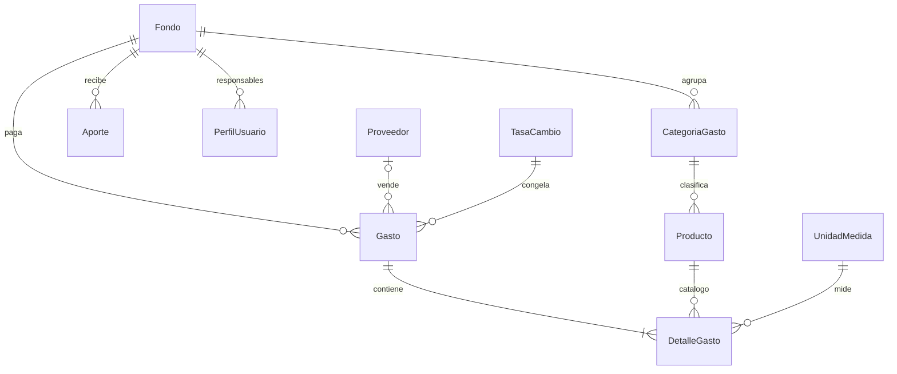

# Edumia — Diseño de modelos: `gastos`

Estado: **aprobado** (G-1 a G-6); G-7 y G-8 siguen abiertas · 2026-09-21
Depende de: `MODELOS_core_academico.md` y `MODELOS_cambio_ingresos.md` (aprobados), D-02, D-09, D-10.

---

## Catálogos

### `Fondo`
| Campo | Tipo | Notas |
| --- | --- | --- |
| `nombre` | Char(80), único | Comedor, Mantenimiento, General |
| `descripcion` | Char(200), blank | |
| `es_general` | Bool | `UniqueConstraint(fields=["es_general"], condition=Q(es_general=True))`: exactamente un Fondo General |
| `activo` | Bool | |

- **Cambio respecto al plan (G-1):** se elimina `Fondo.responsable`. La relación vive solo en `PerfilUsuario.fondo` (ya aprobado en `core`). Así un fondo puede tener varios responsables (dos cocineras) sin duplicar la fuente de verdad.
- El Fondo General se crea por migración de datos y no se puede desactivar ni borrar.

### `CategoriaGasto`
`nombre` Char(80), `fondo` FK null (null = aplica a todos), `activo`. Único `(nombre, fondo)`.

### `UnidadMedida`
`nombre` Char(40) único, `abreviatura` Char(10) único. Fixture: Kg, g, Litro, Unidad, Bulto, Docena, Paquete, Caja.

### `Producto`
| Campo | Notas |
| --- | --- |
| `nombre` | Char(120) |
| `nombre_normalizado` | Char(120), **único**: minúsculas, sin acentos ni espacios dobles. Evita "Tomate" / "tomate " / "Tomáte" como tres productos |
| `categoria` | FK PROTECT |
| `unidad_default` | FK PROTECT |
| `activo` | Bool |

El precio **no** vive aquí (regla del plan): el catálogo solo normaliza nombres.

### `Proveedor` (simple-history)
`nombre` Char(150), `rif` Char(20) null, `telefono` Char(20) blank, `direccion` Text blank, `activo`.
`rif` normalizado (`J-12345678-9` → `J123456789`), único cuando no es null (mismo patrón que D-11).

---

## `Gasto` (cabecera; hereda `MontoBimonedaMixin`, simple-history)

| Grupo | Campos |
| --- | --- |
| Identidad | `uuid_cliente` UUID null único, `fecha` Date, `periodo` FK PROTECT (denormalizado, se deduce de `fecha`), `fondo` FK PROTECT, `proveedor` FK null |
| Documento | `tipo_documento` (`factura`, `nota_entrega`, `recibo`, `sin_soporte`), `numero_documento` Char(40) blank |
| Dinero | Heredado del mixin, con la variante de abajo |
| Flujo | `estado` (`registrado`, `aprobado`, `anulado`), `registrado_por`, `fecha_registro`, `aprobado_por` null, `fecha_aprobacion` null, `motivo_anulacion`, `anulado_por` null, `fecha_anulacion` null, `observacion` Text blank |
| Control | `creado_en`, `actualizado_en` |

### Moneda: una sola por gasto (G-2)
El plan traía `moneda` en la cabecera y `moneda_linea` en cada renglón. Se simplifica: **cada `Gasto` tiene una moneda y sus renglones están en ella**. Un documento (factura, nota) está emitido en una moneda; mezclar obliga a decidir a qué tasa se convierte cada línea y hace que el total no cuadre con el papel. Si una misma salida de dinero fue mixta, se registran dos gastos.

### Variante del cálculo de totales
`Gasto.calcular_montos()` **no** convierte el total. Suma los renglones:
- `monto` = Σ `subtotal` de renglones
- `monto_ves` = Σ `subtotal_ves`; `monto_usd` = Σ `subtotal_usd`

Cada renglón se convierte con la tasa de la cabecera. Así el total del gasto es exactamente la suma de sus partes en ambas monedas, aunque redondear el total por separado difiera un centavo.

### Validaciones
1. Fecha dentro del período y período no cerrado.
2. `UniqueConstraint(proveedor, tipo_documento, numero_documento)` con `condition=Q(proveedor__isnull=False) & ~Q(numero_documento="")`: impide cargar dos veces la misma factura.
3. `tipo_documento == sin_soporte` exige `observacion`.
4. Para aprobar: al menos un renglón y `monto > 0`.
5. Un `responsable_fondo` solo puede registrar en su `PerfilUsuario.fondo`; el administrador, en cualquiera.
6. `estado == aprobado` → solo admite la transición a `anulado`; montos, fecha, moneda, fondo, proveedor y renglones quedan bloqueados (D-09).

### Máquina de estados
| De → A | Quién | Condición |
| --- | --- | --- |
| (nuevo) → registrado | Responsable de fondo / Admin | Validaciones 1–3, 5 |
| registrado → aprobado | Admin | Validación 4; ver G-3 |
| registrado / aprobado → anulado | Admin | `motivo_anulacion` obligatorio |

Como en `Aporte`, todo cambio de estado pasa por `Gasto.transicionar(...)` y deja fila en `RegistroAuditoria`.

Índices: `(fondo, fecha)`, `(periodo, estado)`, `(proveedor, fecha)`, `(registrado_por, estado)`.

---

## `DetalleGasto` (renglón, simple-history)

| Campo | Tipo | Notas |
| --- | --- | --- |
| `gasto` | FK CASCADE | Ver excepción abajo |
| `producto` | FK PROTECT null | Null solo si hay `descripcion` |
| `descripcion` | Char(200), blank | Obligatoria si `producto` es null |
| `cantidad` | Decimal(12,3) | `> 0` (`CheckConstraint`) |
| `unidad` | FK PROTECT | Por defecto `producto.unidad_default`, editable |
| `precio_unitario` | Decimal(18,4) | `>= 0`; **congelado aquí**, en la moneda del gasto |
| `subtotal` | Decimal(18,4) | `cantidad × precio_unitario`, `ROUND_HALF_UP` |
| `subtotal_ves`, `subtotal_usd` | Decimal(18,4) | Convertidos con la tasa de la cabecera |

- `subtotal*` se calculan y guardan en `save()`; luego se recalcula el total de la cabecera con un método explícito `Gasto.recalcular()` (no por señal: más fácil de probar y de leer).
- **Excepción a "nada se borra":** mientras el gasto esté `registrado`, sus renglones pueden agregarse, editarse y quitarse (es su fase de captura). Cada cambio queda en `simple-history`. Al aprobar, se congelan; después solo se anula el gasto completo.
- Historial de precios: `precio_unitario_usd = subtotal_usd ÷ cantidad`, calculado en la consulta del reporte, filtrando gastos `aprobado`. Así se comparan compras hechas en Bs. y en USD.
- Índices: `(producto)`, `(gasto)`. La fecha se obtiene del `Gasto` con JOIN; a este volumen no justifica denormalizar.

---

## Saldo por fondo

`gastos/services.py::saldo_fondo(fondo, hasta=None)` devuelve, **por separado en cada moneda**:

```
saldo_ves = Σ aportes verificados (fondo, monto_ves) − Σ gastos aprobados (fondo, monto_ves)
saldo_usd = Σ aportes verificados (fondo, monto_usd) − Σ gastos aprobados (fondo, monto_usd)
```

Los dos saldos no se convierten entre sí: cada transacción ya trae su tasa congelada, y sumar en cada moneda hace que siempre cuadre con el papel. `Aporte.fondo` nunca es null (G-4), así que no hay aportes "sin fondo" que se pierdan del balance.

Aprobar un gasto que deja el saldo del fondo en negativo **avisa y pide confirmación**, no bloquea (mismo criterio que la desviación de montos).

---

## Diagrama



## Cambios respecto al plan (para tu aprobación)

- [x] **G-1** Se elimina `Fondo.responsable`; la relación queda solo en `PerfilUsuario.fondo`.
- [x] **G-2** Una sola moneda por gasto; se elimina `moneda_linea` del renglón. Total del gasto = suma de renglones convertidos.
- [x] **G-3** Segregación de funciones: quien registra un gasto **no puede aprobarlo**. Propuesta: prohibido por defecto, con un ajuste `Institucion.permitir_autoaprobacion` (falso por defecto) para escuelas donde solo hay un administrador. Sin ese control, una contraloría puede objetar que la misma persona cargó y aprobó el gasto.
- [x] **G-4** `Aporte.fondo` no nulo: si el concepto no tiene fondo, va al Fondo General (creado por migración).
- [x] **G-5** `Producto.nombre_normalizado` único, para evitar duplicados por mayúsculas o acentos.
- [x] **G-6** Excepción explícita: los renglones de un gasto en estado `registrado` sí se pueden quitar; se congelan al aprobar.

## Preguntas abiertas que este diseño deja en pie

- [ ] **G-7 Arrastre de saldo entre períodos.** Propuesta: el saldo de un fondo es **acumulado** (lo que sobra en julio sigue en septiembre) y los reportes por período muestran "saldo anterior + ingresos − gastos". Confirma si el dinero sobrante pasa al nuevo año escolar o se rinde y se reinicia.
- [ ] **G-8 Traslados entre fondos.** El plan no los contempla (por ejemplo, General presta al Comedor). ¿Se necesitan? Si sí, se añade un modelo `TransferenciaFondo` en esta fase. Depende de P-04 (fondo contable o informativo): si el saldo es solo informativo, no hace falta.
